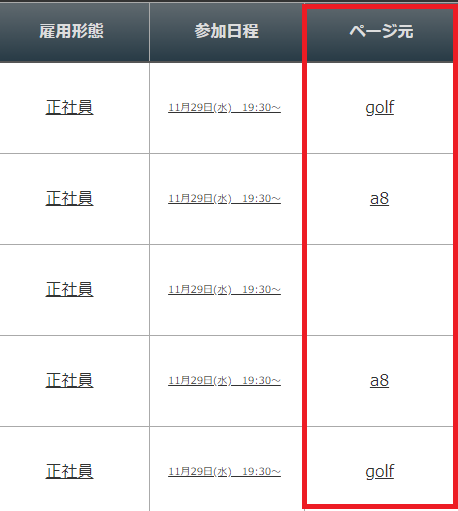
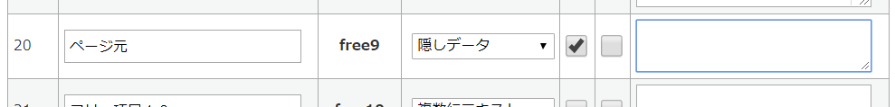
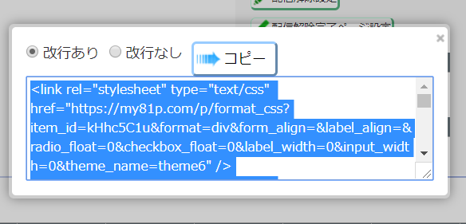

# LPASP
MyASPをはじめとしたASPを導入時、流入元を判別するために、LPに埋め込むスクリプトです。  
・1つのLPで、複数の流入元を判別できます。    
※身内向けです。  

# 結果
下記の画像のように、ユーザーの流入元を一覧表示できます。  


# 使用方法
※MyASP前提で説明します  

## 前提
以下のような流入元サイト、LPのURLと想定します。  
(デフォルト)  http://test.com/index.html    
ゴルフサイト  http://test.com/index.html?page=golf  
A8用サイト  http://test.com/index.html?page=a8  

また、Googleアナリティクスのタグは「UA-12356-1」とします。

## フォーム作成  
シナリオの「登録項目」をクリックします。  
その後、使用していない項目を「ページ元」、形式を「隠しデータ」、利用にチェックをいれます。  
キー項目の英数文字列はコピーします。  


その後、フォームHTMLをコピーします。  


## HTML、JavaScript編集  
上記でコピーしたフォームHTMLを、LPのHTMLに貼り付けます。  

以下のタグを、headタグの直後に貼り付けます。  

```
<script>
  // 設定値 --------------------------------------------------
  // 標準で使用するanalyticsのkey
  analytics_default_key = 'UA-12356-1';

  // ページを判断するために埋め込むhiddenのselector
  lp_page_selector = '#Userfree9';

  // クエリ文字列のキー値
  query_key = 'page';
</script>
<script src="js/lpasp.min.js"></script>
```

githubの右上の「Clone or download」→「Download ZIP」から、javascriptをダウンロードし、「lpasp.min.js」を、FTPの「js」フォルダ内にコピーします。  
※パスが異なる場合、都度htmlファイルを変更を行ってください  

## 設定値詳細

**■analytics_default_key**  
GoogleAnalyticsのトラッキングコードです。  
  
**■lp_page_selector**  
フォーム作成時に、「登録項目」として登録したキー項目キー項目の英数文字列を使用します。  
「#User」 + キー項目 で大丈夫そうです。  
（※エンジニア向け：「登録項目」hidden項目のselectorです）  
  
**■query_key**  
LPのURLの「?page=○○」の、「page」に該当する部分です。  
pageのままが無難です。  
